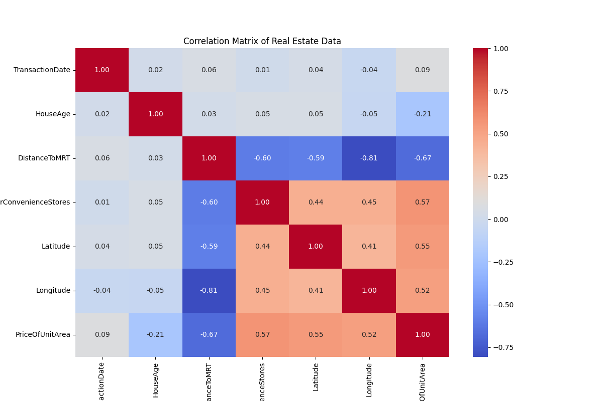
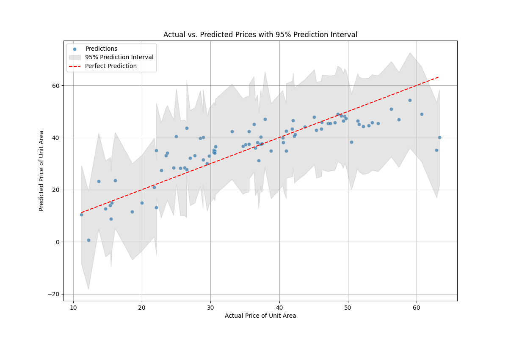

# Taiwan Real Estate Price Prediction using Multiple Linear Regression

This project is a data analysis assignment focusing on predicting real estate prices in Taiwan using a multiple linear regression model. The entire analysis follows the CRISP-DM methodology.

## 1. Business Understanding

The goal is to understand the key factors influencing real estate prices in Taiwan and to build a predictive model that can estimate the price of a property based on its features. The target variable is `PriceOfUnitArea`.

## 2. Data Understanding

*   **Dataset:** [Taiwan Real Estate Prices and Features](https://www.kaggle.com/datasets/noir1112/taiwan-real-estate-prices-and-features-dataset)
*   **Features:** The dataset includes 6 predictor variables:
    *   `TransactionDate`: The date of the transaction
    *   `HouseAge`: Age of the house in years
    *   `DistanceToMRT`: Distance to the nearest MRT station
    *   `NumberConvenienceStores`: Number of convenience stores nearby
    *   `Latitude`: Geographic latitude
    *   `Longitude`: Geographic longitude
*   **Data Quality:** The dataset contains 414 records with no missing values.

## 3. Data Preparation

*   The `No` column was removed as it is an identifier.
*   The data was split into an 80% training set and a 20% testing set.
*   A correlation analysis was performed to understand the relationship between features and the target variable.



**Key Findings from Correlation Analysis:**
*   `DistanceToMRT` has a strong negative correlation (-0.67) with price.
*   `NumberConvenienceStores`, `Latitude`, and `Longitude` have moderate positive correlations.

## 4. Modeling

A multiple linear regression model was built using both `scikit-learn` and `statsmodels`. `statsmodels` was used for a more detailed statistical analysis and to generate prediction intervals.

## 5. Evaluation

The model's performance on the test set was evaluated using the following metrics:

*   **R-squared (R²):** 0.68 (The model explains ~68% of the variance in price)
*   **Root Mean Squared Error (RMSE):** 7.31
*   **Mean Absolute Error (MAE):** 5.31

The OLS regression results from `statsmodels` indicated that `Longitude` was not a statistically significant feature (p-value > 0.05) in the presence of other variables.

## 6. Deployment (Visualization)

A plot was generated to compare the actual prices against the model's predicted prices, including a 95% prediction interval to visualize the model's uncertainty.



## How to Run

1.  **Setup:** Ensure you have Python 3 installed.
2.  **Install Dependencies:**
    ```bash
    pip install -r requirements.txt
    ```
3.  **Execute Script:**
    ```bash
    python app.py
    ```
4.  **Check Outputs:** The script will generate `correlation_heatmap.png` and `prediction_plot.png`.